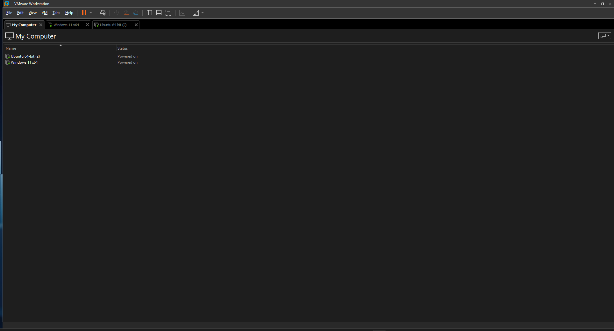
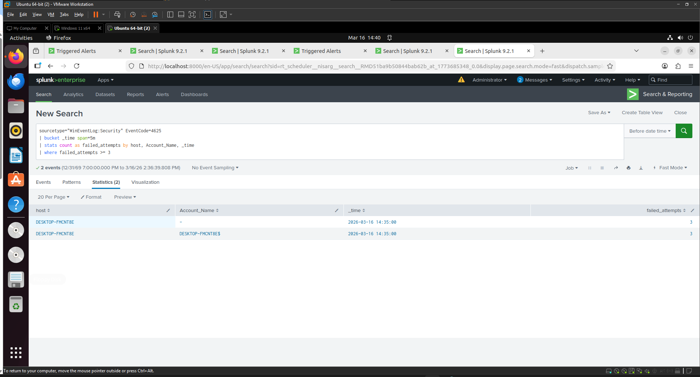
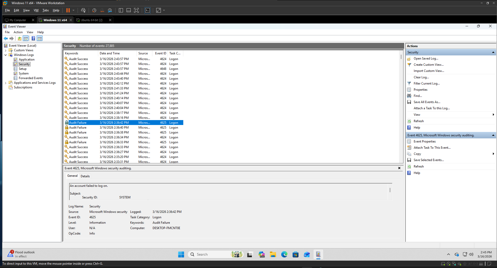
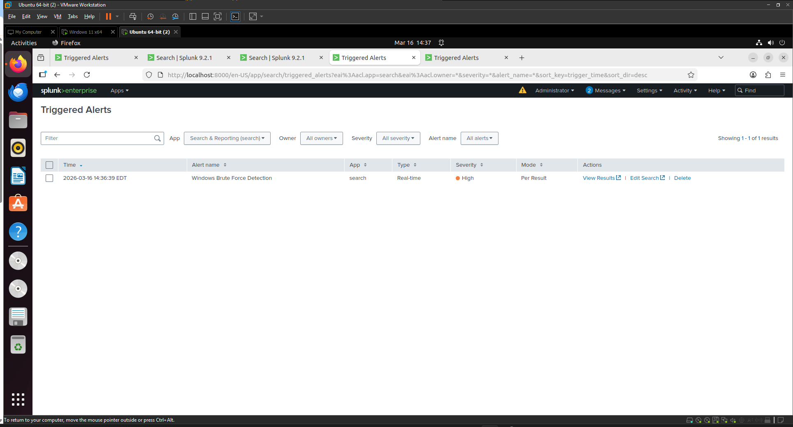
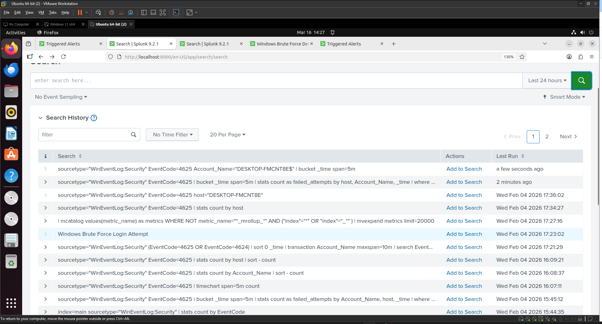

Great — since your screenshots are in the screenshots folder in this repo:

Repo:
Nisargpatelx/splunk-siem-brute-force-detection-lab

The correct GitHub image path format is:

screenshots/filename.png

Below is your correct README with real image links based on your folder.

Complete README.md (with correct screenshot links)
# Splunk SIEM Brute Force Detection Lab

This project demonstrates a **Security Information and Event Management (SIEM) detection lab** built using **Splunk Enterprise** to detect brute-force login attempts on a Windows system.

The lab simulates a real SOC monitoring environment where Windows security logs are ingested into Splunk and analyzed using SPL queries to identify suspicious authentication activity.

---

## Lab Environment

The lab environment was built using **VMware Workstation** with two virtual machines.

• Ubuntu Server running **Splunk Enterprise (SIEM)**  
• Windows 11 endpoint generating security logs

The Windows machine forwards logs to Splunk where detection queries analyze authentication activity.

---

## Architecture Overview

The SIEM detection pipeline works as follows:

1. Windows endpoint generates **Security Event Logs**
2. Failed login attempts are recorded as **Event ID 4625**
3. Splunk Forwarder sends logs to the Splunk server
4. Splunk indexes and analyzes the logs
5. Detection rule identifies **multiple failed login attempts**
6. Splunk triggers a **security alert**

---

## Detection Logic

The detection rule identifies multiple failed login attempts occurring within a short time window.

### SPL Detection Query

sourcetype="WinEventLog:Security" EventCode=4625
| bucket _time span=5m
| stats count as failed_attempts by host, Account_Name, _time
| where failed_attempts >= 3

This query detects brute-force login attempts by identifying multiple failed authentication attempts within a **5-minute window**.

---

## Detection Query Screenshot

The screenshot below shows the **Splunk detection query and results**.

---

## Windows Failed Login Event

Windows records failed login attempts as **Event ID 4625** in the Security Event Log.

These events contain:

• Account name  
• Source system  
• Logon type  
• Timestamp  
• Failure reason  

These logs are forwarded to Splunk where they are analyzed for brute-force activity.

---

## Alert Triggered

When the threshold of failed login attempts is reached, Splunk triggers a **real-time security alert** indicating possible brute-force activity.

---

## Additional Query Analysis

Splunk search history and query execution used during detection development.

---

## Key Skills Demonstrated

This project demonstrates practical experience with:

• SIEM monitoring  
• Splunk Enterprise configuration  
• Log ingestion and analysis  
• Windows Security Event Log investigation  
• Splunk SPL query development  
• Brute-force attack detection  
• Security alerting and monitoring  

---

## Tools and Technologies

• Splunk Enterprise  
• Splunk Universal Forwarder  
• Windows Event Logs  
• VMware Workstation  
• Ubuntu Server  
• Windows 11  

---

## Learning Outcomes

Through this project I gained hands-on experience with:

• Building a SIEM lab environment  
• Ingesting endpoint logs into Splunk  
• Developing detection rules using SPL  
• Investigating authentication events  
• Implementing alert-based threat detection  

---

## Author

**Nisarg Patel**  
Cybersecurity Graduate Student  
SOC | SIEM | Threat Detection
